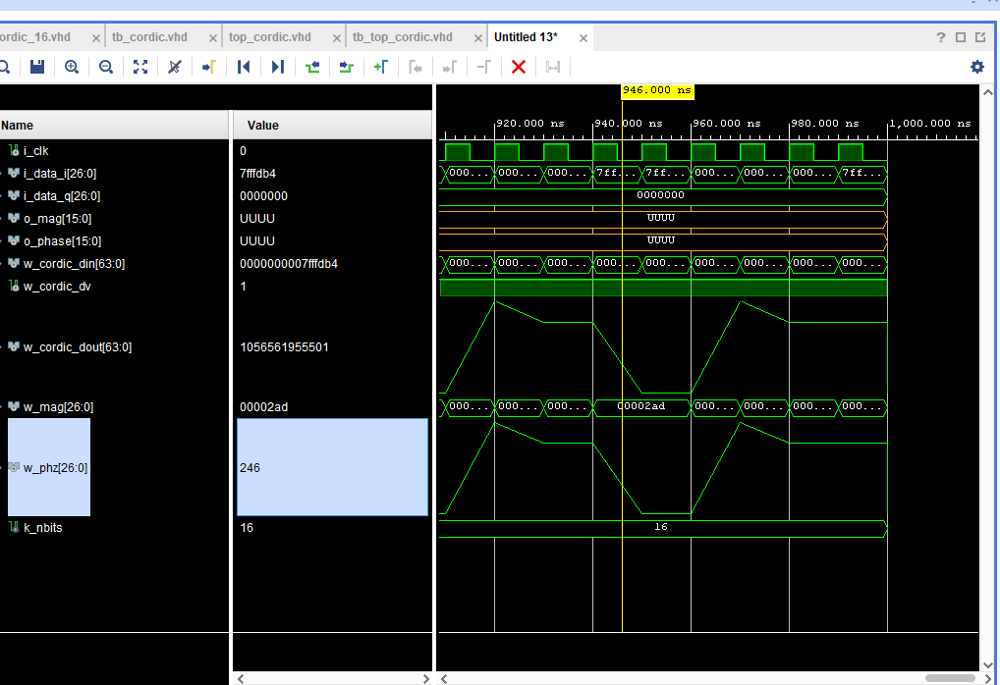

# FPGA Signal Processing

A collection of `VHDL` implementations and supporting MATLAB scripts for exploring digital signal-processing pipelines on FPGA hardware. These modules progresses from foundational logic and arithmetic blocks to a sampled-data processing chain incorporating `Direct Digital Synthesis (DDS)` generation to simulate analog waves by loading waveform data from `BRAM memory`, `windowing`, `FFT`, `CORDIC`, `filtering`, and Hilbert-transform processing for `Basys-3-board`. 

These modules were developed throughout a 7-day intensive short course on FPGA signal processing course hosted by `Sierra Nevada Corporation (SNC)`. All modules were tested in simulation using Vivado and MATLAB, and the top-level demonstrations were implemented on a `Basys-3` board and then tested again on hardware.

## Xilinix Vivado Project Layout

```text
.
├── src.xpr              # Vivado project
├── src.srcs/
│   ├── sources_1/new/                 # VHDL/SystemVerilog source modules
│   ├── sources_1/ip/                  # Vivado IP configuration files
│   └── sim_1/new/                     # VHDL testbenches
├── Matlab/                            # Test-vector/LUT generation and plotting
├── Modules/                           # Standalone Tang Nano 20K experiments
├── Basys-3-Master.xdc                 # Xilinx pin constraints
└── screenshots/                       # Captured synthesis/debug results
```

## Main DSP blocks

All design sources are in [`src.srcs/sources_1/new/`](src.srcs/sources_1/new/). They are organised below from fundamental logic through to complete signal-processing demonstrations.

### 1. Fundamental logic and control

| Module | Description |
| --- | --- |
| `xor2.vhd` | Two-input XOR gate. |
| `and3.vhd` | Three-input AND gate. |
| `reg_xor2.vhd` | Registered two-input XOR gate. |
| `reg_and3.vhd` | Registered three-input AND gate. |
| `counter.vhd` | Parameterised synchronous counter with enable, limit, and done output. |
| `decoder4.vhd` | Four-bit decoder. |
| `encoder_16_4.vhd` | 16-to-4 encoder. |
| `state_machine.vhd` | State-machine example. |
| `lfsr32.vhd` | 32-bit linear-feedback shift register. |
| `rom_rand_module.vhd` | ROM-based random-data source. |

### 2. Arithmetic and sample-processing blocks

| Module | Description |
| --- | --- |
| `mult.vhd` | Registered real multiplier. |
| `accum.vhd` | Parameterised signed accumulator. |
| `maf4.vhd` | Four-sample moving-average filter. |
| `noise_gen.vhd` | Noise generator that combines four seeded 32-bit LFSRs. |
| `vadc.vhd` | Virtual ADC that plays generated waveform data from `vadc_pkg`. |
| `dds.vhd` | Direct digital synthesiser with a phase accumulator and sine/cosine lookup table. |
| `win.vhd` | 1024-sample windowing block using coefficients from `win_pkg`. |
| `cmult.vhd` | Pipelined complex multiplier. |

### 3. DSP pipelines and IP-based processing

| Module | Description |
| --- | --- |
| `cfir.vhd` | Complex FIR filter composed of real and imaginary Xilinx FIR IP cores. |
| `hilbert.vhd` | I/Q signal path combining DDS mixing, complex multiplication, and filtering. |
| `top_fft.vhd` | Virtual-ADC source connected to the 1024-point Xilinx FFT IP core. |
| `top_cordic.vhd` | FFT output connected to Xilinx CORDIC IP for magnitude/phase processing. |

### Xilinx IP blocks

The following Vivado IP configurations are stored in `src.srcs/sources_1/ip/` and are used by the DSP demonstrations:

| IP block | Purpose | Used by |
| --- | --- | --- |
| `fft_1024` | 1024-point streaming FFT. | `top_fft.vhd`, `top_cordic.vhd`, and `top_win.vhd` |
| `xfft_0` | Additional Xilinx FFT configuration retained in the project. | Available for FFT experiments |
| `cordic_16` | CORDIC processing for FFT magnitude and phase. | `top_cordic.vhd`, `top_win.vhd` |
| `fir_lpf` | Low-pass FIR filter. | `top_fir.vhd` |
| `fir_real` | FIR filter for the real-path terms of the complex FIR. | `cfir.vhd` |
| `fir_imag` | FIR filter for the imaginary-path terms of the complex FIR. | `cfir.vhd` |

### 4. Top-level demonstrations

| Module | Description |
| --- | --- |
| `top.vhdl` | Basic LED/switch top-level example. |
| `top2.vhd` | Combinational XOR/AND hierarchy demonstration. |
| `top3.vhd` | Registered XOR/AND hierarchy demonstration. |
| `top_counter.vhd` | Counter demonstration. |
| `top_decoder4.vhd` | Decoder demonstration. |
| `encoder16_4_top.vhd` | 16-to-4 encoder demonstration. |
| `top_encoder16_4.vhd` | Alternative 16-to-4 encoder top-level. |
| `top_mult.vhd` | Multiplier demonstration with counter and ROM stimulus. |
| `top_accum.vhd` | Accumulator demonstration with counter and ROM stimulus. |
| `top_cmult.vhd` | Complex-multiplier demonstration with counter and ROM stimulus. |
| `top_noise_gen.vhd` | Noise-generator demonstration. |
| `top_vadc.vhd` | Virtual-ADC demonstration. |
| `top_win.vhd` | Windowing, FFT, and CORDIC demonstration. |
| `top_hilbert.vhd` | Hilbert I/Q processing demonstration. |
| `top_fir.vhd` | Hilbert output connected to low-pass FIR IP. |
| `top_cfir.vhd` | Complex-FIR demonstration. |

## Schematics

Some top level schematics

### Complex multiplier module


### Top-level FIR filter module


## Test Benches

All the modules were tested with VHDL test benches located in the Vivado project under `src.srcs/sim_1`. MATLAB was used to generate test vectors and plot results for the FIR, Hilbert, and CORDIC processing blocks. The MATLAB scripts are located in the `Matlab/` directory.

For example the `cordic_tb.m` generates test vectors for the `top_cordic.vhd` demonstration. The test bench waveform is shown below.



## Appendix

### Tang Nano experiments

The independent examples in `experiments/` target the Tang Nano 20K (GW2AR-LV18QN88C8/I7). They use the Open Source Suite: `Yosys`, the `GHDL plugin`, `nextpnr-himbaechel`, `gowin_pack`, and `openFPGALoader`. This was done as an experiment to port the VHDL modules on my own hardware at home from my Macbook, independent from Xilinix Vivado. 
